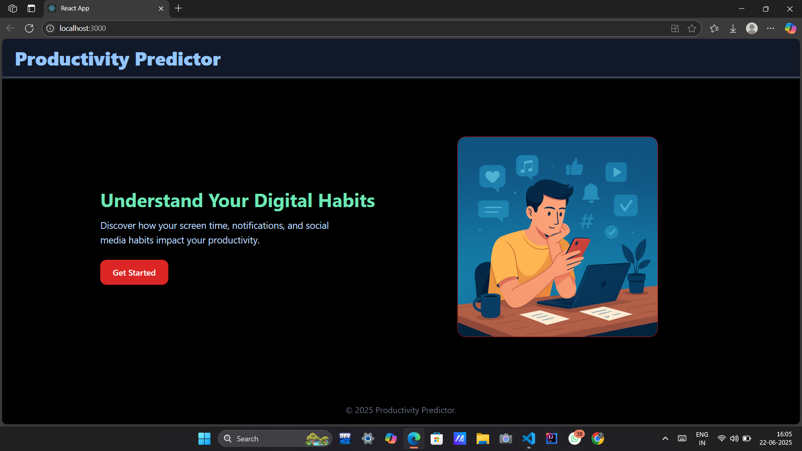

# Productivity Predictor

A full-stack web application that uses a Machine Learning model to predict a user's productivity based on their digital habits such as screen time, sleep, social media usage, and more.

Built using React, Flask, and scikit-learn.

## Features

- Predicts if a user is **Productive** or **Distracted**
- Backend built with Flask and a trained Random Forest model
- Uses 10 key features selected via variance threshold
- Clean UI with Tailwind CSS
- Deployable frontend (Netlify) + backend (Render)

## Screenshots

###  Home Page


###  Predictor Form
.png)

### ✅ Result Page
.png)

.png)


## Tech Stack

 Layer           Tech                
 Frontend    :   React, Tailwind CSS 
 Backend     :   Flask (Python)      
 ML Model    :   RandomForestClassifier (scikit-learn) 
 API Calls   :   Axios               
 Deployment  :   Netlify (frontend), Render (backend) 


## Run Locally

### Backend (Flask + ML API)

```bash
cd backend
pip install -r requirements.txt
python app.py

### Frontend (React)
cd frontend  # or root if React is in main folder
npm install
npm start
